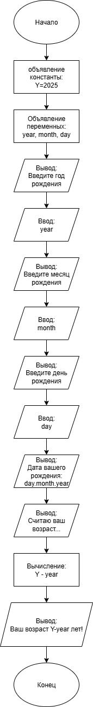
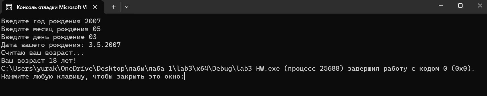

# Домашняя работа к лабораторной работе 3.
## Условия задачи:
Написать и отладить программу вычисления возраста по дате рождения
## 1. Алгоритм и блок схема:
### Алгоритм:
1. **Начало**
2. Объявить константы:
   - `Y` = 2025 — текущий год
4. Объявить переменные:
 	- `year` — год рождения
	- `month` — месяц рождения
	- `day` — день рождения
5. Ввод переменных:
   - Ввод переменной: `year`
   - Ввод переменной: `month`
   - Ввод переменной: `day`
6. Вычислить год рождения:
   - `Y` - `year`
7. Вывести результаты расчётов с подстановкой значений в текст.
8. **Конец**

### Блок схема

## 2. Реализация программы:
	#include <locale.h>
	#include <stdio.h>
	#define Y 2025

	int main() {
		setlocale(LC_ALL, "");
		int year, month, day;
		printf("Введите год рождения");
		scanf("%d", &year);
		printf("Введите месяц рождения");
		scanf("%d", &month);
		printf("Введите день рождение");
		scanf("%d", &day);
		printf("Дата вашего рождения: %d.%d.%d\n", day, month, year);
		puts("Считаю ваш возраст...");
		printf("Ваш возраст %d лет!", Y - year);
	}
## 3. Результат работы программы

## 4. Информация о разработчике
Капичников Юрий, бИПТ-252
